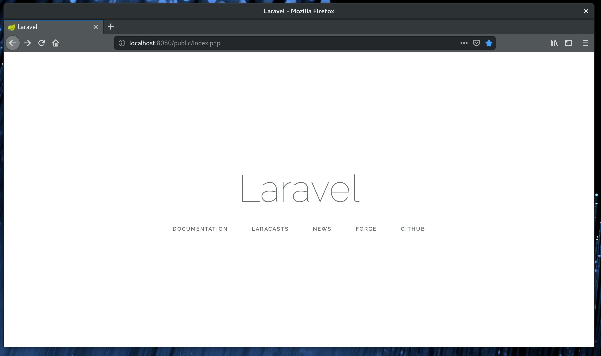

# Runtime Converter Laravel Java Demo
Example conversion of laravel done by the Runtime Converter (RuntimeConverter.com)

### Usage (for testing only)

1) `cd laravel-converted`
2) `./gradlew bootRun`
3) In browser navigate to http://localhost:8080/public/index.php

### Platforms

Currently works on Mac OS and Linux. JNI code is downloaded via gradle.

Requires JVM 8+ installed.

### Folder structure

/laravel contains the INPUT files (PHP)
/laravel-converted contains the OUTPUT files (Java)

### License

The code in this repository is licensed via MIT license, but note that this does not cover modules downloaded by gradle, including runtimeconverterlib. The license for runtimeconverterlib can be found by converting a file or project at php2java.com. This codebase is an *EXAMPLE* of what the the RuntimeConverter is capable of and is *NOT* inteded for any other purpose. To discuss the conversion of projects using laravel, visit runtimeconverter.com.

### Output

The output at "http://localhost:8080/public/index.php" is the standard laravel welcome screen.

### Attribution

The code in this repository is converted from *MULTIPLE* sources gathered together by the "composer.json" file in the laravel project. The source code for the INPUT code is provided inside of the folder "larvel" and subtree. See laravel/vendor. Additionally, the provision of MIT license for this code is only for the translated work and is still subject to the licenses provided by each INPUT file.

### Modifications

Laravel uses a generated code cache that was converted with the project to avoid having to convert php to java at runtime. The file "Compiler.java" (Illuminate/View/Compilers) has been modified to use relative paths and avoid code cache expiration. The input code is otherwise not modified.
